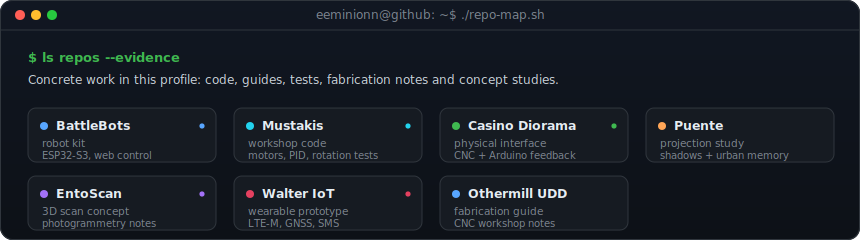
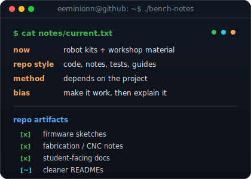
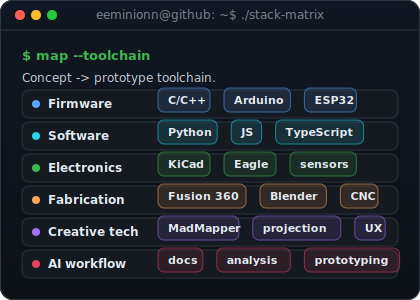

<!-- animated contribution graph: real public GitHub data, refreshed daily by .github/workflows/update-profile-art.yml -->

<h3><code>eeminionn@github ~ $ ./contributions.sh</code></h3>

 
 

<h3><code>eeminionn@github ~ $ whoami</code></h3>

<table>
<tr>
<td valign="top"></td>
<td valign="top"></td>
</tr>
</table>

 
 

<h3><code>eeminionn@github ~ $ ./links.sh</code></h3>

<b>Interaction designer building robotics, embedded systems and learning tools.</b>

<code>hardware</code> · <code>firmware</code> · <code>digital fabrication</code> · <code>creative technology</code> · <code>AI-assisted prototyping</code>

 
 

<h3><code>eeminionn@github ~ $ ./systems.sh</code></h3>

 
 

<table>
<tr>
<td valign="top"></td>
<td valign="top"></td>
</tr>
</table>

 

# Emilio Abarca

Interaction Design student at **Universidad del Desarrollo (UDD)** working across **robotics, embedded systems, digital fabrication, education and AI-assisted prototyping**.

I care about projects that survive contact with reality: motors that actually move, interfaces people can understand, workshop material that another person can repeat, and documentation that makes the system easier to improve.

## Positioning

I design and build learning-centered technical systems. That means I move between the product questions and the engineering questions:

- What should the user understand after using this?
- What physical behavior does the prototype need to prove?
- What hardware, firmware and fabrication choices make it reliable enough to teach with?
- What needs to be documented so the next person can build on it?

## Leadership and Teaching

- Founder of **EIRI UDD**, an interdisciplinary robotics and innovation team.
- Mentor at **Fundacion Mustakis**, bringing robotics and STEAM experiences to new generations.
- Active in the UDD robotics community through workshop design, technical documentation and student-facing prototypes.

## Build Tracks

| Track | What I build | Evidence |
| --- | --- | --- |
| Robotics education | ESP32-based robot kits, workshop exercises, control tests and competition formats. | [BattleBots 2026-1](https://github.com/eeminionn/battleBots2026-1), [Mustakis 2025-2](https://github.com/eeminionn/mustakis2025-2) |
| Physical interaction | Objects that connect sensing, fabrication, storytelling and feedback. | [Casino Diorama](https://github.com/eeminionn/showtimeDioramaCasino), [Diorama concept docs](https://github.com/eeminionn/Diorama-Casino) |
| Digital fabrication | CNC, 3D printing and fabrication workflows that become usable workshop references. | [Othermill UDD](https://github.com/eeminionn/othermill-udd) |
| Creative technology | Projection mapping, spatial narratives and interactive learning experiences. | [Puente Condell](https://github.com/eeminionn/Puente-Condell--Memoria-Proyectada) |
| IoT and sensing | Wearable and connected prototypes with location, emergency and sensor logic. | [Walter DevKit IoT](https://github.com/eeminionn/walterDevKitIoT) |

## Selected Systems

| Project | Area | Why it matters |
| --- | --- | --- |
| [BattleBots 2026-1](https://github.com/eeminionn/battleBots2026-1) | Robotics education | ESP32-S3 mecanum robot kit for a UDD workshop cycle, with web control, PCB support and a competition challenge. |
| [Casino Diorama](https://github.com/eeminionn/showtimeDioramaCasino) | Physical interaction | Fabrication and interaction project combining Blender, 3D printing, CNC, Arduino and sensory feedback. |
| [Puente Condell: Memoria Proyectada](https://github.com/eeminionn/Puente-Condell--Memoria-Proyectada) | Digital storytelling | Projection mapping proposal using animated shadows to explore urban memory under Puente Condell. |
| [Mustakis 2025-2](https://github.com/eeminionn/mustakis2025-2) | Robotics education | Motor, PID and rotation test sketches for educational robotics workshops. |
| [EntoScan](https://github.com/eeminionn/EntoScan) | 3D scanning | 3D digitization concept for endemic insects using photogrammetry, infrared scanning and educational visualization. |
| [Walter DevKit IoT](https://github.com/eeminionn/walterDevKitIoT) | Wearable IoT | ESP32-S3/LTE-M/GNSS wearable safety prototype for emergency SMS and location alerts. |

## Toolchain

| Domain | Tools and technologies |
| --- | --- |
| Firmware | C/C++, Arduino, ESP32, sensors, motors, servos, control loops |
| Software | Python, JavaScript, TypeScript, web interfaces, automation scripts |
| Electronics | PCB design, Eagle, KiCad, prototyping, debugging |
| Fabrication | Fusion 360, Blender, 3D printing, CNC machining |
| Creative tech | MadMapper, projection mapping, physical interfaces |
| Analysis | Python, ANOVA, PCA, exploratory analysis, AI-assisted documentation |

## Operating Principles

- Prototype against real constraints: power, motors, materials, assembly, timing and users.
- Make systems observable: logs, tests, diagrams and small experiments beat vague confidence.
- Document the path, not only the final artifact, so projects can become workshops.
- Treat design as a technical tool: clarity, affordances and feedback are part of the system.
- Use AI to accelerate exploration and documentation, then validate with hardware and people.

## Current Focus

- Designing robotics workshops with clear hardware, firmware and learning outcomes.
- Building educational kits that help students understand electronics through competition and experimentation.
- Improving the bridge between visual design, physical prototyping and maintainable code.

## Contact

[LinkedIn](https://www.linkedin.com/in/emilioabarcar) · [Portfolio](https://www.emilioabarca.com) · [Robotics Club](https://instagram.com/robotica_udd) · [Email](mailto:e.abarcar@udd.cl)

> Build the thing, test the thing, explain the thing.
