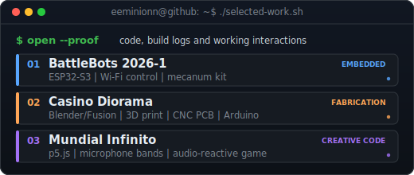
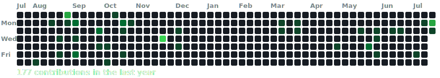

<h3><code>eeminionn@github ~ $ whoami</code></h3>

<table>
<tr>
<td width="35%" valign="top"></td>
<td width="65%" valign="top"></td>
</tr>
</table>

<b>Interaction Design student building embedded systems, physical interfaces and creative code.</b>

 
 

<h3><code>eeminionn@github ~ $ ./selected-work.sh</code></h3>

[**01 / BattleBots 2026-1**](https://github.com/eeminionn/battleBots2026-1) · [**02 / Casino Diorama**](https://github.com/eeminionn/showtimeDioramaCasino) · [**03 / Mundial Infinito**](https://github.com/eeminionn/PulsoDeEstadioSinestesico)

 
 

<h3><code>eeminionn@github ~ $ ./contributions.sh</code></h3>

 

# Emilio Abarca

Interaction Design student at **Universidad del Desarrollo (UDD)** building across software and the physical world: robots, connected devices, fabricated interfaces and audiovisual experiments.

These repositories contain firmware, workshop material, fabrication logs, tests and design documentation. Implementation details stay close to the artifacts: pinouts near firmware, machine settings near fabricated parts and controls near interactive code.

## Community

- Founder of **EIRI UDD**, an interdisciplinary robotics and innovation team.
- Mentor at **Fundacion Mustakis**, supporting robotics and STEAM learning experiences.
- Contributor to workshop guides, technical documentation and student-facing prototypes at UDD.

## More Work

| Repository | What is inside |
| --- | --- |
| [MallMetrics](https://github.com/eeminionn/mallMetrics) | Django and Chart.js tooling for pedestrian-flow studies, CSV reports and heatmaps. |
| [Coca-Cola Stock Monitor](https://github.com/eeminionn/coca-cola-stock-monitor) | Scheduled Python monitor with catalog comparison and GitHub Actions alerts. |
| [EntoScan](https://github.com/eeminionn/EntoScan) | 3D scanning, photogrammetry and an educational AR concept for endemic insects. |
| [Walter DevKit IoT](https://github.com/eeminionn/walterDevKitIoT) | ESP32-S3 wearable prototype using LTE-M, GNSS and emergency messaging logic. |
| [Puente Condell](https://github.com/eeminionn/Puente-Condell--Memoria-Proyectada) | Projection mapping, animated shadows and spatial storytelling documentation. |
| [Othermill UDD](https://github.com/eeminionn/othermill-udd) | Practical CNC and PCB fabrication guide for workshop use. |
