# 👋 Hi, I'm Emilio Abarca  

🎓 **Interaction Design Student – Universidad del Desarrollo (UDD)**  
🤖 **Founder of the Interdisciplinary Robotics & Innovation Team (EIRI UDD)**  
👨‍🏫 **Robotics Mentor & Educator – Fundación Mustakis**  
💡 Passionate about **Robotics, Artificial Intelligence, IoT, Computer Vision & Digital Fabrication**  

---

## 🚀 About Me
I’m a designer and tech innovator with experience in **electronics prototyping, microcontroller programming, and digital fabrication**.  
I have worked on projects that integrate **educational robotics, IoT, computer vision, and interactive installations**.  

My approach combines **design, engineering, and innovation**, applied to solving real-world challenges and driving projects with social and educational impact.  

---

## 🛠️ Tech & Tools

**Programming Languages**  

**Hardware & Electronics**  

**Digital Fabrication & Design**  

**Others**  

---

## 📊 GitHub Stats

  
  

---

## 📊 Extended Metrics Dashboard

---

## 🚀 Featured Projects
- ⚡ **EIRI UDD** – Interdisciplinary robotics team for innovation and competitions.  
- 🎮 **Interactive Casino Diorama** – Project combining 3D printing, CNC, and Arduino.  
- 🤖 **Line-Follower & Rescue Robots** – C++ + ESP32 + sensors.  
- 🎥 **Puente Condell Mapping** – Visual storytelling with MadMapper and projection mapping.  

---

## 🌐 Connect with Me
- 💼 [LinkedIn](https://www.linkedin.com/in/your-profile)  
- 📷 [Instagram Robótica UDD](https://instagram.com/robotica_udd)  
- 📧 [Email](mailto:youremail@domain.com)  

---

✨ *“Designing the future at the intersection of creativity, technology, and innovation.”* ✨
